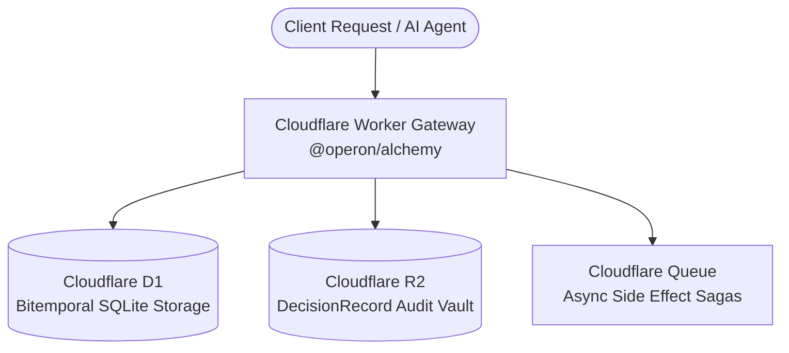

# @operon/alchemy

Serverless edge infrastructure synthesis for **Operon** on **Cloudflare**, powered by [Alchemy](https://alchemy.run).

---

## Infrastructure Topology



---

## Synthesized Resources

- **`cloudflare:worker`**: Edge HTTP handler evaluating Bearer authentication and routing queries and actions.
- **`cloudflare:d1_database`**: Edge relational storage for bitemporal tables and active operational state.
- **`cloudflare:r2_bucket`**: Immutable cryptographic vault storing long-term `DecisionRecord` audit dossiers.
- **`cloudflare:queue`**: Message queue handling asynchronous side effects with Saga compensation rollbacks.

---

## Usage

```typescript
import {
  synthesizeAlchemyManifest,
  createWorkerFetchHandler,
} from "@operon/alchemy";

// Synthesize infrastructure definition
const manifest = synthesizeAlchemyManifest({
  name: "operon-edge",
  region: "auto",
});

// Worker fetch handler
export default {
  fetch: createWorkerFetchHandler({
    objectStore,
    auditStore,
    inbox,
    securityEngine,
  }),
};
```
